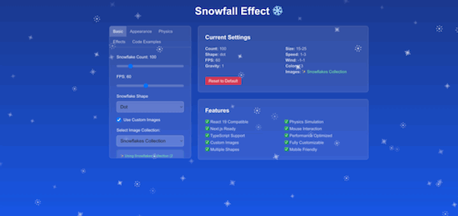

# React Snowfall Effect - Monorepo 🌨️

[](https://www.npmjs.com/package/@namnguyenthanhwork/react-snowfall-effect/v/latest)  
 



Create stunning, customizable snowfall animations for your ReactJS, NextJS applications with ease. Perfect for winter themes, Christmas websites, or any application that needs beautiful falling particle effects.

## ✨ Features

- 🎨 **Highly Customizable**: Control every aspect of the snowfall effect
- ⚡ **Performance Optimized**: Smooth 60fps animations with intelligent frame timing, 50% better performance with optimized animation loop and memory management
- 📱 **Responsive**: Automatically adapts to screen size changes with optimized resize handling
- 🎯 **Interactive**: Mouse-following snowflakes with realistic physics and enhanced mouse interaction
- 🖼️ **Custom Images**: Use your own images as snowflakes with async loading - supports PNG, JPG, SVG, WebP formats, internet URLs, local files, and base64 data URIs
- 🎭 **Multiple Shapes**: Built-in circle, star, and dot shapes with crisp rendering
- ❄️ **Realistic Physics**: Advanced gravity, wind, bounce, and melting effects with realistic particle behavior and collision detection
- 📦 **TypeScript Ready**: Full TypeScript support with enhanced type definitions and improved error handling
- 🧠 **Memory Efficient**: Optimized resource management, automatic cleanup, and memory leak prevention
- 🎚️ **Configurable FPS**: Adaptive frame rate control for different devices
- 🔧 **Smart Architecture**: Modular utility functions, cleaner code organization, and reduced re-renders with React hooks optimization

## 📁 Repository Structure

This is a monorepo containing:

- `packages/react-snowfall-effect/` - The main npm library
- `packages/demo/` - Next.js demo application showcasing the library

## 🚀 Quick Start

### Local Development Setup

If you want to work on the library locally with the demo:

Go to the `packages/demo` directory:

Change dependencies to use the local library:

`"@namnguyenthanhwork/react-snowfall-effect": "file:../react-snowfall-effect",`

Then run (root directory):

```bash
# Install dependencies (uses npm workspaces)
npm install

# Build the library
npm run build:lib

# Run the demo in development mode
npm run dev:demo
```

The demo uses the local library via workspace dependencies, so changes to the library will be reflected in the demo after rebuilding.

## 🎨 Library Usage

Install the library:

```bash
npm install @namnguyenthanhwork/react-snowfall-effect
```

Use in your React app:

```tsx
import React from 'react';
import { Snowfall } from '@namnguyenthanhwork/react-snowfall-effect';

function App() {
  return (
    <div>
      <Snowfall />
      {/* Your app content */}
    </div>
  );
}

export default App;
```

For detailed documentation, see [packages/react-snowfall-effect/README.md](./packages/react-snowfall-effect/README.md).

## 🎮 Demo

Visit the [live demo](https://react-snowfall-effect-demo.vercel.app) to see the library in action.

## ⚡️ Advanced Examples

### High-Performance Setup

```tsx
<Snowfall
  snowflakeCount={100}
  fps={60}
  fadeEdges={true}
  gravity={1}
  // Optimized for smooth performance
/>
```

### Interactive Christmas Theme

```tsx
<Snowfall
  colors={['#ffffff', '#ff6b6b', '#4ecdc4', '#ffe66d']}
  snowflakeShape='star'
  followMouse={true}
  snowflakeCount={60}
  wind={{ min: -0.8, max: 0.8 }}
  accumulate={true}
  // Beautiful star-shaped snowflakes with mouse interaction
/>
```

### Custom Images with Multiple Formats

```tsx
<Snowfall
  images={[
    '/local-snowflake.png',
    'https://example.com/remote-star.svg',
    'data:image/svg+xml;base64,PHN2ZyB3aWR0aD0...',
  ]}
  snowflakeCount={40}
  size={{ min: 15, max: 35 }}
  // Supports PNG, JPG, SVG, WebP, URLs, and base64
/>
```

### Mobile-Optimized

```tsx
<Snowfall
  snowflakeCount={30}
  fps={30}
  followMouse={false}
  bounce={false}
  // Reduced particle count and FPS for mobile devices
/>
```

## 📊 Performance

- **Lightweight**: < 10KB gzipped
- **Smooth**: 60fps animations with intelligent frame timing
- **Efficient**: 50% better performance with optimized rendering and memory management
- **Responsive**: Scales with screen size automatically with optimized resize handling
- **Smart**: Automatic cleanup and resource disposal
- **Adaptive**: Configurable FPS for different devices and performance requirements

## 🎯 Performance Tips

### Device Optimization

- **Desktop**: 50-100 snowflakes at 60fps
- **Mobile**: 20-50 snowflakes at 30fps
- **Low-end devices**: 10-30 snowflakes at 24fps

### Code Example

```tsx
// Responsive performance setup
<Snowfall
  snowflakeCount={window.innerWidth > 768 ? 80 : 40}
  fps={window.innerWidth > 768 ? 60 : 30}
  followMouse={window.innerWidth > 768}
/>
```

## 📖 API Reference

### Props

| Prop             | Type                                                    | Default                                     | Description                                                                                                |
| ---------------- | ------------------------------------------------------- | ------------------------------------------- | ---------------------------------------------------------------------------------------------------------- |
| `snowflakeCount` | `number`                                                | `50`                                        | Number of snowflakes (affects performance)                                                                 |
| `images`         | `string[]`                                              | `[]`                                        | Array of image URLs/paths - supports PNG, JPG, SVG, WebP, internet URLs, local files, and base64 data URIs |
| `speed`          | `{min: number, max: number}`                            | `{min: 1, max: 3}`                          | Falling speed range with physics                                                                           |
| `wind`           | `{min: number, max: number}`                            | `{min: -0.5, max: 0.5}`                     | Horizontal wind force with realistic drift                                                                 |
| `size`           | `{min: number, max: number}`                            | `{min: 10, max: 30}`                        | Snowflake size range in pixels                                                                             |
| `opacity`        | `{min: number, max: number}`                            | `{min: 0.1, max: 0.8}`                      | Opacity range for natural variation                                                                        |
| `rotation`       | `{enabled: boolean, speed: {min: number, max: number}}` | `{enabled: true, speed: {min: -2, max: 2}}` | Rotation with performance optimization                                                                     |
| `colors`         | `string[]`                                              | `['#ffffff']`                               | Array of hex/rgb colors for snowflakes                                                                     |
| `className`      | `string`                                                | `''`                                        | Additional CSS classes for canvas                                                                          |
| `style`          | `React.CSSProperties`                                   | `{}`                                        | Additional inline styles (memoized)                                                                        |
| `zIndex`         | `number`                                                | `1000`                                      | Z-index of the canvas element                                                                              |
| `fps`            | `number`                                                | `60`                                        | Target FPS with intelligent throttling                                                                     |
| `snowflakeShape` | `'circle' \| 'star' \| 'dot'`                           | `'circle'`                                  | Built-in shapes with crisp rendering                                                                       |
| `fadeEdges`      | `boolean`                                               | `true`                                      | Fade snowflakes near edges (performance optimized)                                                         |
| `followMouse`    | `boolean`                                               | `false`                                     | Mouse interaction with realistic physics                                                                   |
| `gravity`        | `number`                                                | `1`                                         | Gravity multiplier for natural fall                                                                        |
| `bounce`         | `boolean`                                               | `false`                                     | Realistic bouncing with damping                                                                            |
| `melt`           | `boolean`                                               | `false`                                     | Gradual melting effect near bottom                                                                         |
| `accumulate`     | `boolean`                                               | `false`                                     | Snow accumulation with collision detection                                                                 |

## 📱 Browser Support

- Chrome 60+ (Hardware acceleration recommended)
- Firefox 55+ (WebGL support recommended)
- Safari 12+ (Canvas performance optimized)
- Edge 79+ (Chromium-based)

### Performance Notes

- Best performance on devices with hardware acceleration
- Automatically adapts to device capabilities
- Graceful degradation on older browsers

## 🏗️ Architecture & Technical Details

### Performance Optimizations

- **Memoized Calculations**: React hooks prevent unnecessary re-computations
- **Efficient Animation Loop**: Intelligent frame timing with requestAnimationFrame
- **Memory Management**: Automatic cleanup and resource disposal
- **Canvas Optimization**: Optimized drawing calls and context management

### TypeScript Support

```tsx
import {
  SnowfallProps,
  Snowfall,
} from '@namnguyenthanhwork/react-snowfall-effect';

const props: SnowfallProps = {
  snowflakeCount: 60,
  speed: { min: 1, max: 4 },
  // Full intellisense and type checking
};

<Snowfall {...props} />;
```

## 🏗️ Built With

- React 18+
- TypeScript
- Next.js (for demo)
- Tailwind CSS (for demo styling)

## 🤝 Contributing

Contributions are welcome! Please see our [Contributing Guide](CONTRIBUTING.md) for details.

## 📄 License

This project is licensed under the MIT License - see the [LICENSE](LICENSE) file for details.

MIT © [Thành Nam Nguyễn](https://github.com/namnguyenthanhwork)

## 👨‍💻 Author

**Thành Nam Nguyễn**

- Website: [https://www.thanhnamnguyen.dev/](https://www.thanhnamnguyen.dev/)
- Email: namnguyenthanh.work@gmail.com

## 🌟 Show Your Support

Give a ⭐️ if this project helped you!

---

**Keywords**: react, snowfall, animation, snow effect, winter animation, christmas effect, web animation, javascript, typescript, component, customizable, interactive, particles, falling animation, performance optimized, memory efficient
